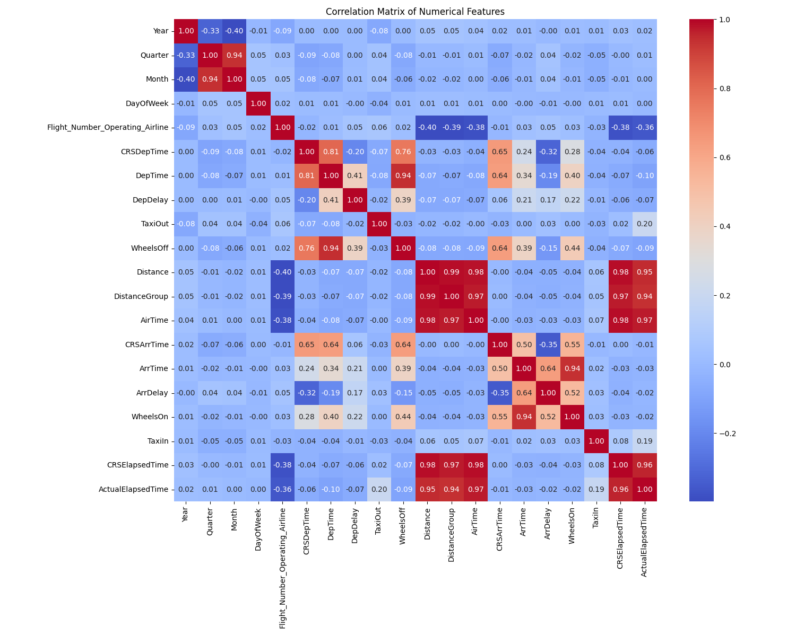
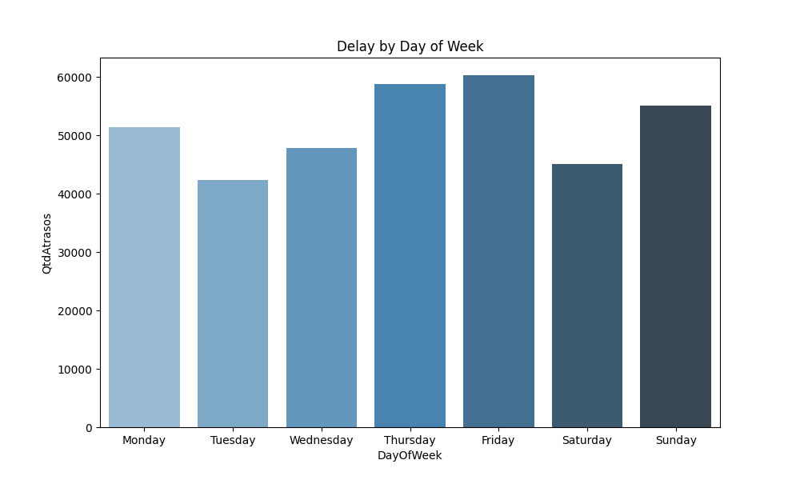

# ✈️ Flight Delay Prediction

A machine learning pipeline built with PySpark that predicts whether a flight will arrive delayed, with real-time inference via Apache Kafka.

## Overview

This project uses historical U.S. flight data to train a binary classification model (delayed vs. on time) and serves predictions in real time using a Kafka producer/consumer architecture.

**Model performance (GBT Classifier):**
- AUC-ROC: 0.78
- Accuracy: 0.72
- F1 Score: 0.71

---

## Project Structure

```
flights_prediction/
├── data_prep.py          # Data cleaning and preprocessing
├── data_analysis.py      # Exploratory data analysis and visualizations
├── train.py              # Model training and evaluation
├── kafka-producer.py     # Streams flight records to Kafka
├── kafka-consumer.py     # Consumes records and outputs real-time predictions
├── models/
│   ├── pipeline/         # Saved PySpark ML pipeline
│   └── gbt_flights/      # Saved GBT model
├── clean_dataset/        # Cleaned data (CSV)
├── streaming_dataset/    # Sample data used for streaming simulation
└── plots/                # Generated visualisation outputs
```

---

## Pipeline

### 1. Data Preparation (`data_prep.py`)
- Reads raw flight data from `flights.csv`
- Removes duplicates and irrelevant columns
- Converts departure/arrival times from HHMM format to minutes
- Drops rows with missing values
- Saves the cleaned dataset and a 1000-row streaming sample

### 2. Exploratory Data Analysis (`data_analysis.py`)
- Computes a Pearson correlation matrix across numerical features
- Visualises delays by day of week
- Uses PySpark MLlib, Pandas, Seaborn, and Plotly

### 3. Model Training (`train.py`)
- Creates the binary target: `delayed = 1` if `ArrDelay > 25 minutes`
- Engineers features: `hour`, `is_summer`, `is_holiday_season`, `time_of_day`
- Preprocessing pipeline:
  - `StringIndexer` for categorical columns (airline, origin, destination)
  - `VectorAssembler` to merge all features into a single vector
  - `StandardScaler` to normalise numerical features
- Trains a **Gradient Boosted Trees (GBT)** classifier
- Saves the pipeline and model to disk

### 4. Real-Time Inference
- **`kafka-producer.py`** reads the streaming dataset and sends one flight record every 10 seconds to the `flights` Kafka topic
- **`kafka-consumer.py`** receives each record, applies the saved pipeline and model, and prints the prediction

---

## Requirements

### Python dependencies
```bash
pip install pyspark kafka-python pandas numpy matplotlib seaborn plotly
```

### Kafka
```bash
brew install kafka
brew services start kafka
kafka-topics --create --topic flights --bootstrap-server localhost:9092 --partitions 1 --replication-factor 1
```

---

## Usage

### 1. Prepare the data
```bash
python data_prep.py
```

### 2. Analyse the data (optional)
```bash
python data_analysis.py
```

### 3. Train the model
```bash
python train.py
```

### 4. Start the Kafka producer (Terminal 1)
```bash
python kafka-producer.py
```

### 5. Start the Kafka consumer (Terminal 2)
```bash
python kafka-consumer.py
```

You should see real-time predictions like:
```
HNL → LAX | WN | Previsão: ATRASADO ✈
SFO → JFK | AA | Previsão: A TEMPO ✅
```

---

## Features Used

| Feature | Description |
|---|---|
| `Month` | Month of the year |
| `DayOfWeek` | Day of the week (1=Monday) |
| `CRSDepTime` | Scheduled departure time (HHMM) |
| `Distance` | Flight distance in miles |
| `DepDelay` | Departure delay in minutes |
| `Operating_Airline` | Airline code |
| `Origin` | Origin airport code |
| `Dest` | Destination airport code |
| `hour` | Hour extracted from CRSDepTime |

> Columns like `ArrTime`, `TaxiIn`, `WheelsOn`, and `ActualElapsedTime` were excluded to avoid **data leakage** — they only exist after the flight lands.

---

## Plots

### Correlation Matrix


Pearson correlation matrix across all numerical features. Highlights strong correlations between departure delay and arrival delay, as well as between scheduled and actual elapsed times.

### Delays by Day of Week


Bar chart showing the number of delayed flights (ArrDelay > 15 min) per day of the week. Useful for identifying which days tend to have more disruptions.

---

## Tech Stack

- **PySpark / MLlib** — distributed data processing and machine learning
- **Apache Kafka** — real-time message streaming
- **kafka-python** — Kafka client for Python
- **Pandas / Seaborn / Plotly** — data analysis and visualisation